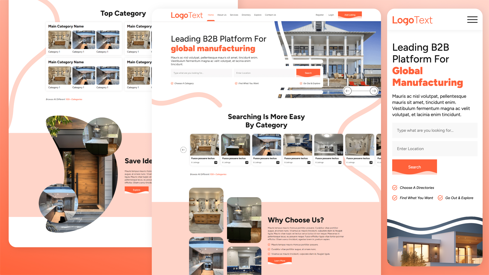

# B2B-manufacturing-directory-website
A modern B2B directory website with homepage, listing page, and details page built using HTML and CSS.

# B2B Manufacturing Directory Website

A modern and clean **B2B directory website UI** designed for **global manufacturers, suppliers, and industrial businesses**.  
This project includes a professional multi-page frontend layout with a homepage, directory listing page, and directory details page.

---

## 📌 Project Overview

This project is a **frontend B2B business directory website** created to showcase a modern directory platform design for manufacturing and industrial businesses.

The goal of this project is to present a **clean, structured, and user-friendly business listing interface** with a professional visual style.

---

## 📄 Pages Included

This project contains **3 main pages**:

### 1. Home Page (`index.html`)
Includes:
- Hero banner
- Search section
- Featured directory cards
- Why choose us section
- Top directory section
- Insights / ideas section
- Community CTA
- App download banner
- Footer

### 2. Directory Listing Page (`directory-listing.html`)
Includes:
- Directory listings layout
- Business / category cards
- Structured listing section for browsing directories

### 3. Directory Details Page (`directory-details-page.html`)
Includes:
- Detailed directory/business view
- Information section
- Content layout for selected listing

---

## ✨ Features

- Modern B2B landing page design
- Multi-page website structure
- Clean business directory UI
- Card-based layout
- Professional typography and spacing
- Modern section-based page design
- User-friendly content structure

---

## 🎨 Design Highlights

- Soft and elegant color palette
- Rounded card design
- Creative background shapes and curves
- Business-focused modern UI
- Minimal and clean visual hierarchy

---

## 🛠️ Technologies Used

- HTML5
- CSS3
- Responsive Web Design Principles
- Flexbox / CSS Layout Techniques

---

## 📂 Project Structure

```bash
project-folder/
│
├── index.html
├── directory-listing.html
├── directory-details-page.html
├── style.css
├── images/
└── README.md
```

> If your CSS or images are in separate folders, you can update the structure accordingly.

---

## 📸 Preview

Add your project screenshot here:

```md

```

> Replace `preview.jpg` with your actual screenshot file name.

---

## 🚀 How to Run

1. Clone this repository:
   ```bash
   git clone https://github.com/Ajayvk811/B2B-manufacturing-directory-website/
   ```

2. Open the project folder

3. Run `index.html` in your browser

---

## 🎯 Purpose of This Project

This project was created for:

- Frontend development practice
- UI/UX portfolio showcase
- GitHub portfolio presentation
- Multi-page website design practice
- B2B directory platform concept

---

## 📈 Future Improvements

- Add full mobile responsiveness
- Add hover and scroll animations
- Add filters and search functionality
- Add JavaScript interactivity
- Improve directory listing experience
- Convert into React version in future

---

## 👨‍💻 Author

**Ajay Vishwakarma**

If you like this project, feel free to star the repository ⭐

---

## 📄 License

This project is open for learning and portfolio showcase purposes.
